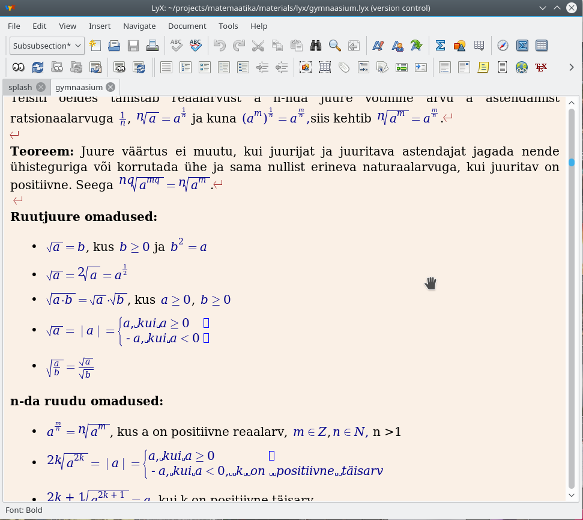

# Matemaatika minileksikon

Matemaatika minileksikon on põhikoolile ja gümnaasiumile mõeldud tarkvara, kus on olemas
kursustel kasutatavad definitsioonid, mõisted ja kirjeldused. Materjalidest leiab
ka detailsemaid näiteid ning seletusi.

Programm on koostatud lähtuvalt matemaatika õppekavast aastaks 2010/2011 ja on eelkõige mõeldud
kasutamiseks abivahendina.

Materjalid ja tarkvara on koostanud Kristjan Krips ja Timo Petmanson.

# Litsents

Programmi lähtekood on avalik [GNU GPL litsentsi](https://www.gnu.org/licenses/gpl-3.0.en.html) alusel
ja kõik õppemmaterjalid ja joonised on avaldatud [Creative Commons Attribution-ShareAlike 4.0 International License](http://creativecommons.org/licenses/by-sa/4.0/) alusel.

Lühidalt tähendab see, et nii programmi lähtekoodi kui materjalid on avalikud. 
Tarkvara kasutajatel on võimalus aidata kaasa arendustegevuses ja õppematerjalide kaasajastamisel ja täiendamisel. 

# Materjalide lisamine ja muutmine

Materjalide kirjutamiseks kasutame tekstitöötlusprogrammi Lyx, mis võimaldab mugavalt sisestada nii teksti kui valemeid.
Erinevate klasside materjalid asuvad kataloogis `materjalid/lyx`.
Kuigi Lyx on suurepärane valemite toimetamiseks, on mõnikord tarvis kuvada ka graafikuid ja pilte, mis on loodud teiste programmidega
ja asuvad kataloogis `materjalid/lyx/img`.
Kõik pildid ja graafikud peavad olema `.svg` formaadis.
SVG on vektorformaat ja võimaldab graafikuid joonistada erineva ekraanitihedusega seadmetel teravalt.



Antud struktuuri järgmine on oluline, et oleks võimalik materjale automaatselt teisendada kujule, mida saab kuvada appis.

# Materjalide teisendamine appi jaoks sobivale kujule

Kataloogis `/materials/lyx` tuleb käivitada käsk:

```
./prepare_materials.sh
```

Antud käsk teisendab Lyx sisu HTML kujule ning käivitab indekseerija.
Tulemused paigaldatakse automaatselt õigetesse kaustadesse, kus äpp saab neid kasutada.


